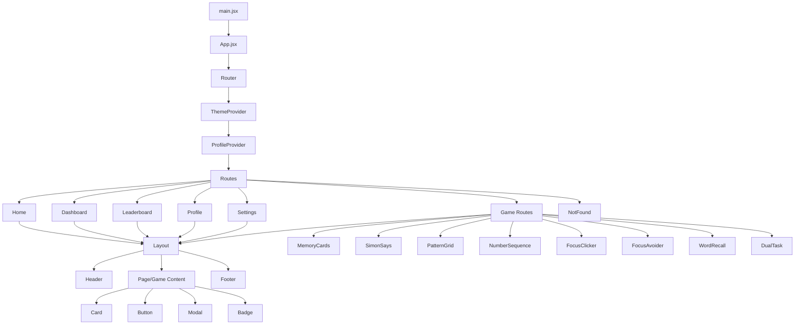
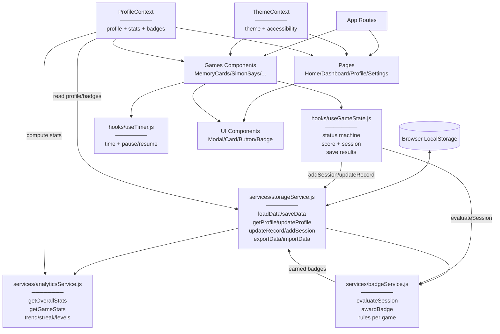

# 🧠 Memory Trainer - Brain Training Platform

**Memory Trainer** — це SPA-додаток для тренування пам’яті та уваги, побудований на **Vite + React 19** з використанням **Hooks**, **TailwindCSS v4** та **React Router**.
Додаток містить набір міні-ігор (Memory Cards, Simon Says, Pattern Grid тощо), систему профілю, статистику, лідерборд, бейджі (achievements), теми оформлення та налаштування доступності (**sound / animations / font size**).

---

## Table of Contents

* [🚀 Стек технологій](#-стек-технологій)
* [📂 Структура проєкту](#-структура-проєкту)
* [🌳 Component Tree (CT)](#-component-tree-ct)

  * [Опис Component Tree](#опис-component-tree)
* [🔄 Data Flow Diagram (DF)](#-data-flow-diagram-df)
* [📋 Опис Data Flow](#-опис-data-flow)
* [🎨 Design Patterns](#-design-patterns)

- [1. Provider Pattern (Context API)](#1-provider-pattern-context-api)
- [2. Custom Hook Pattern (композиція логіки)](#2-custom-hook-pattern-композиція-логіки)
- [3. Container/Presenter Pattern (Smart/Dumb Components)](#3-containerpresenter-pattern-smartdumb-components)
- [4. Facade Pattern (спрощення доступу до складного шару)](#4-facade-pattern-спрощення-доступу-до-складного-шару)
- [5. Observer Pattern (реактивні підписки через Context)](#5-observer-pattern-реактивні-підписки-через-context)
- [6. Optimistic Update Pattern (спочатку UI/стан — потім сайд-ефекти)](#6-optimistic-update-pattern-спочатку-uiстан--потім-сайд-ефекти)
- [7. Memoization Pattern (оптимізація через useCallback)](#7-memoization-pattern-оптимізація-через-usecallback)
- [8. Validation / Guard Clauses Pattern (перевірки перед дією)](#8-validation--guard-clauses-pattern-перевірки-перед-дією)
- [9. Composite Pattern (вкладені компоненти)](#9-composite-pattern-вкладені-компоненти)
- [10. Strategy Pattern (динамічна поведінка залежно від умов)](#10-strategy-pattern-динамічна-поведінка-залежно-від-умов)
- [11. Higher-Order “Wrapper” Pattern (компонент-обгортка з додатковою логікою)](#11-higher-order-wrapper-pattern-компонент-обгортка-з-додатковою-логікою)
- [12. Singleton Pattern (єдиний екземпляр сервісу)](#12-singleton-pattern-єдиний-екземпляр-сервісу)
- [13. Callback Props Pattern (комунікація через колбеки)](#13-callback-props-pattern-комунікація-через-колбеки)
- [14. Module Pattern (інкапсуляція через модулі ES)](#14-module-pattern-інкапсуляція-через-модулі-es)
* [🔄 Типові сценарії використання](#-типові-сценарії-використання)

  * [Сценарій 1: Запуск гри та початок сесії](#сценарій-1-запуск-гри-та-початок-сесії)
  * [Сценарій 2: Завершення гри та збереження результату](#сценарій-2-завершення-гри-та-збереження-результату)
  * [Сценарій 3: Отримання бейджа](#сценарій-3-отримання-бейджа)
  * [Сценарій 4: Зміна теми та доступності](#сценарій-4-зміна-теми-та-доступності)
  * [Сценарій 5: Оновлення імені профілю](#сценарій-5-оновлення-імені-профілю)
  * [Сценарій 6: Перегляд статистики та лідерборду](#сценарій-6-перегляд-статистики-та-лідерборду)
* [⚙️ Основні Hooks](#️-основні-hooks)
* [🔌 API інтеграція](#-api-інтеграція)

  * [Модуль services/storageService.js](#модуль-servicesstorageservicejs)
* [▶️ Запуск проєкту](#️-запуск-проєкту)
* [📌 Функціонал](#-функціонал)

  * [✅ Основні можливості](#-основні-можливості)
  * [🎨 Візуальні ефекти](#-візуальні-ефекти)
* [🔧 Деталі реалізації](#-деталі-реалізації)

  * [Управління станом](#управління-станом)
  * [Оптимізація продуктивності](#оптимізація-продуктивності)
  * [Обробка помилок](#обробка-помилок)
  * [Стилізація](#стилізація)
* [🎨 Кастомні анімації](#-кастомні-анімації)
* [💡 Висновок](#-висновок)
* [📝 Додаткові нотатки](#-додаткові-нотатки)

  * [Особливості архітектури](#особливості-архітектури)
  * [Можливі покращення](#можливі-покращення)

---

## 🚀 Стек технологій

* [Vite](https://vitejs.dev/) – швидкий білдер/дев-сервер для React SPA
* [React 19](https://react.dev/) – компоненти, hooks, memoization
* [React Router](https://reactrouter.com/) – маршрутизація сторінок та ігор
* [TailwindCSS v4](https://tailwindcss.com/) – utility-first стилізація + CSS variables через `@theme`
* [React Icons](https://react-icons.github.io/react-icons/) – іконки для UI/навігації/бейджів
* **LocalStorage** – збереження профілю, рекордів, сесій, бейджів (офлайн)
* **Services layer** – `storageService`, `analyticsService`, `badgeService`
* [ESLint](https://eslint.org/) – базова якість коду

---

**🔝 [Вернутися до змісту](#table-of-contents)**

---

## 📂 Структура проєкту

```
memory-trainer/
├── src/
│   ├── components/
│   │   ├── layout/
│   │   │   ├── Header.jsx        # Навігація + перемикач теми
│   │   │   └── Layout.jsx        # Каркас сторінок + гарячі клавіші + footer
│   │   └── ui/
│   │       ├── Badge.jsx         # UI бейдж
│   │       ├── Button.jsx        # Універсальна кнопка
│   │       ├── Card.jsx          # Контейнер-картка
│   │       └── Modal.jsx         # Модальні вікна (результати/пауза/підтвердження)
│   ├── contexts/
│   │   ├── ProfileContext.jsx    # Профіль + статистика + бейджі (global state)
│   │   └── ThemeContext.jsx      # Теми + доступність (sound/animations/font)
│   ├── games/
│   │   ├── MemoryCards/          # Matching game
│   │   │   └── MemoryCards.jsx
│   │   ├── SimonSays/
│   │   │   └── SimonSays.jsx
│   │   ├── PatternGrid/
│   │   │   └── PatternGrid.jsx
│   │   ├── NumberSequence/
│   │   │   └── NumberSequence.jsx
│   │   ├── FocusClicker/
│   │   │   └── FocusClicker.jsx
│   │   ├── FocusAvoider/
│   │   │   └── FocusAvoider.jsx
│   │   ├── WordRecall/
│   │   │   └── WordRecall.jsx
│   │   └── DualTask/
│   │       └── DualTask.jsx
│   ├── hooks/
│   │   ├── useGameState.js       # State machine гри + сесії + рекорди + бейджі
│   │   ├── useTimer.js           # Таймер (pause/resume) для ігор
│   │   └── useLocalStorage.js    # Універсальна синхронізація localStorage
│   ├── pages/
│   │   ├── Home.jsx              # Меню ігор
│   │   ├── Dashboard.jsx         # Загальна аналітика
│   │   ├── Leaderboard.jsx       # Рекорди/топи
│   │   ├── Profile.jsx           # Профіль + прогрес + дані користувача
│   │   ├── Settings.jsx          # Тема/доступність/експорт-імпорт
│   │   └── NotFound.jsx          # 404
│   ├── services/
│   │   ├── storageService.js     # Робота з localStorage + імпорт/експорт даних
│   │   ├── analyticsService.js   # Розрахунки прогресу/статистики/трендів
│   │   └── badgeService.js       # Логіка видачі бейджів за умови
│   ├── App.jsx                   # Router + Providers + Routes
│   ├── main.jsx                  # Точка входу Vite
│   ├── index.css                 # Tailwind v4 + теми + анімації
│   └── App.css
├── package.json
├── vite.config.js
└── ...
```

**🔝 [Вернутися до змісту](#table-of-contents)**

---

## 🌳 Component Tree (CT)



### Опис Component Tree

Ця діаграма показує **основну ієрархію компонентів**:

* **main.jsx** – точка входу Vite, монтує React дерево.
* **App.jsx** – збирає **Router + Providers + Routes**.
* **ThemeProvider** (`src/contexts/ThemeContext.jsx`) – керує:

  * темою (light/dark/high-contrast/ocean)
  * accessibility (звук/анімації/розмір шрифту)
* **ProfileProvider** (`src/contexts/ProfileContext.jsx`) – керує:

  * профілем користувача (ім’я/тема)
  * статистикою (через `analyticsService`)
  * бейджами (через `badgeService` + `storageService`)
* **Layout** (`src/components/layout/Layout.jsx`) – каркас сторінок, header/footer, гарячі клавіші (наприклад `M` для звуку, `P` для паузи).
* **Pages** (`src/pages/*`) – сторінки меню/статистики/профілю/налаштувань.
* **Games** (`src/games/*`) – міні-ігри, які використовують `useGameState` та `useTimer`.
* **UI components** (`src/components/ui/*`) – універсальні презентаційні компоненти: `Card`, `Button`, `Modal`, `Badge`.

---

**🔝 [Вернутися до змісту](#table-of-contents)**

---

## 🔄 Data Flow Diagram (DF)



---

## 📋 Опис Data Flow

Цей блок показує **як дані рухаються** між localStorage, сервісами, хуками та UI.

---

### 1️⃣ “API” шар (локальний)

У цьому проєкті немає зовнішнього REST API — роль “API” виконує **services layer**, який працює з localStorage.

* `services/storageService.js` – єдиний вхід до даних (profile/records/sessions/badges).
* `services/analyticsService.js` – робить обчислення (average, streak, trend, memory level).
* `services/badgeService.js` – перевіряє умови та видає бейджі.

---

### 2️⃣ Hooks Layer

#### **useGameState.js** – state machine для будь-якої гри

Функції/ідея:

* контролює `status` (idle/ready/playing/paused/finished)
* рахує score та збирає sessionData
* при завершенні — зберігає сесію та рекорди в `storageService`
* перевіряє бейджі через `badgeService`

Скорочений приклад:

```javascript
// hooks/useGameState.js
const GAME_STATUS = {
  IDLE: "idle",
  READY: "ready",
  PLAYING: "playing",
  PAUSED: "paused",
  FINISHED: "finished",
}

function useGameState(gameId, initialGameData = {}) {
  const [status, setStatus] = useState(GAME_STATUS.IDLE)
  const [gameData, setGameData] = useState(initialGameData)
  const [score, setScore] = useState(0)

  const finishGame = useCallback(() => {
    setStatus(GAME_STATUS.FINISHED)

    // 1) зберегти сесію
    // 2) оновити рекорд
    // 3) перевірити бейджі
  }, [gameId, score, gameData])

  return { status, score, gameData, setGameData, setScore, finishGame }
}
```

---

#### **useTimer.js** – таймер з pause/resume

Використовується в іграх для часу/зворотнього відліку, підтримує паузу.

```javascript
// hooks/useTimer.js
function useTimer(initialTime = 0, countDown = false) {
  const [time, setTime] = useState(initialTime)
  const [isRunning, setIsRunning] = useState(false)
  const [isPaused, setIsPaused] = useState(false)

  const start = useCallback(() => { /* ... */ }, [])
  const pause = useCallback(() => { /* ... */ }, [])
  const resume = useCallback(() => { /* ... */ }, [])
  const reset = useCallback(() => { /* ... */ }, [])

  return { time, isRunning, isPaused, start, pause, resume, reset }
}
```

---

### 3️⃣ Context Layer

#### **ThemeContext.jsx**

* Теми (light/dark/high-contrast/ocean)
* Accessibility: `soundEnabled`, `animationsEnabled`, `fontSize`
* Оновлює `document.documentElement` через CSS class та `data-theme`

#### **ProfileContext.jsx**

* `profile` береться зі `storageService.getProfile()`
* `stats` обчислюється через `analyticsService.getOverallStats()`
* `badges` береться зі `storageService.getBadges()`
* оновлення профілю/статистики викликає ре-рендер підписаних компонентів

---

### 4️⃣ Рівень сторінок та ігор

* **Games** викликають `useGameState()` + `useTimer()` та через них змінюють дані.
* **Pages** (Dashboard/Leaderboard/Profile) читають агреговані результати через ProfileContext/analyticsService.

---

**🔝 [Вернутися до змісту](#table-of-contents)**

---

## 🎨 Design Patterns

### 1. **Provider Pattern** (Context API)

**Де використано:**

* `ThemeProvider` → `src/contexts/ThemeContext.jsx`
* `ProfileProvider` → `src/contexts/ProfileContext.jsx`
* Підключення провайдерів → `src/App.jsx`

**Код:**

```jsx
// src/App.jsx
<Router>
  <ThemeProvider>
    <ProfileProvider>
      <Routes>{/* pages */}</Routes>
    </ProfileProvider>
  </ThemeProvider>
</Router>
```

```jsx
// src/contexts/ThemeContext.jsx
const ThemeContext = createContext();

export function ThemeProvider({ children }) {
  const value = { theme, changeTheme, cycleTheme, accessibility, updateAccessibility, ... };
  return <ThemeContext.Provider value={value}>{children}</ThemeContext.Provider>;
}

export function useTheme() {
  const context = useContext(ThemeContext);
  if (!context) throw new Error('useTheme must be used within ThemeProvider');
  return context;
}
```

**Переваги:**

* Глобальний стан без prop drilling
* Єдине “джерело правди” для теми/налаштувань/профілю
* Захист від неправильного використання (throw, якщо поза Provider)

---

### 2. **Custom Hook Pattern** (композиція логіки)

**Де використано:**

* `useGameState` → `src/hooks/useGameState.js` (статус гри, score, сесії, пауза/резюм, finish)
* `useTimer` → `src/hooks/useTimer.js` (таймер з паузою/резюмом)
* `useLocalStorage` → `src/hooks/useLocalStorage.js` (робота зі значенням у localStorage)

**Код:**

```js
// src/hooks/useGameState.js
function useGameState(gameId, initialGameData = {}) {
  const [status, setStatus] = useState(GAME_STATUS.IDLE);
  const [gameData, setGameData] = useState(initialGameData);
  const [score, setScore] = useState(0);

  const finishGame = useCallback((finalData = {}) => {
    setStatus(GAME_STATUS.FINISHED);

    const sessionData = { gameId, score, ...gameData, ...finalData };
    storageService.addSession(sessionData);
    const earnedBadges = badgeService.checkAndAwardBadges(gameId, sessionData);

    return { ...sessionData, earnedBadges };
  }, [gameId, score, gameData]);

  return { status, gameData, score, finishGame, pauseGame, resumeGame, resetGame, ... };
}
```

**Переваги:**

* Логіка гри / часу / localStorage винесена з UI
* Повторне використання в різних іграх
* Простіше підтримувати і тестувати

---

### 3. **Container/Presenter Pattern** (Smart/Dumb Components)

**Де використано:**

* **Container (Smart):** сторінки/ігри → `src/pages/*`, `src/games/*` (стан, правила гри, навігація)
* **Presenter (Dumb/UI):** `src/components/ui/*` (`Button`, `Card`, `Modal`, `Badge`) + `src/components/layout/*`

**Приклад в проєкті:**

* `src/games/FocusClicker/FocusClicker.jsx` (container) використовує `Card/Button/Modal` (presenters)

```jsx
// src/games/FocusClicker/FocusClicker.jsx (фрагмент)
import Card from '../../components/ui/Card';
import Button from '../../components/ui/Button';
import Modal from '../../components/ui/Modal';
import useGameState from '../../hooks/useGameState';

const gameState = useGameState('focusClicker');
```

**Переваги:**

* UI-компоненти максимально універсальні
* Логіка зосереджена в контейнерах (іграх/сторінках)
* Легше міняти дизайн без переписування правил гри

---

### 4. **Facade Pattern** (спрощення доступу до складного шару)

**Де використано:**

* `storageService` → `src/services/storageService.js` (обгортка над `localStorage`, дефолтні дані, імпорт/експорт, профіль/рекорди/сесії)
* `analyticsService` → `src/services/analyticsService.js` (обчислення статистики)
* `badgeService` → `src/services/badgeService.js` (перевірка умов, видача бейджів)

**Код:**

```js
// src/services/storageService.js (фрагмент)
loadData() {
  try {
    const data = localStorage.getItem(STORAGE_KEY);
    return data ? JSON.parse(data) : null;
  } catch (error) {
    console.error('Помилка читання:', error);
    return null;
  }
}
```

**Переваги:**

* Компоненти не думають “як саме” зберігаються дані
* Єдині правила збереження/читання для всього додатку
* Легше замінити localStorage на інший бекенд у майбутньому

---

### 5. **Observer Pattern** (реактивні підписки через Context)

**Де використано:**

* Будь-який компонент з `useTheme()` або `useProfile()` автоматично “підписаний” на зміни контексту

**Приклад:**

* `src/pages/Settings.jsx` читає `useTheme()` і `useProfile()` — при зміні теми/доступності/профілю UI сам оновиться.

```jsx
// src/pages/Settings.jsx
const { theme, changeTheme, accessibility, updateAccessibility } = useTheme();
const { clearAllData } = useProfile();
```

**Переваги:**

* Нема ручних “підписок/відписок”
* React сам робить оновлення потрібних частин UI

---

### 6. **Optimistic Update Pattern** (спочатку UI/стан — потім сайд-ефекти)

Тут немає remote API, але логіка така ж: **стан оновлюється одразу**, паралельно зберігаються дані в storage.

**Де використано:**

* `useGameState.finishGame` → одразу ставить `FINISHED` і пише сесію в storage
* `FocusClicker.finishGame` → оновлює рекорд і показує результати без очікувань “серверної відповіді”

**Код:**

```jsx
// src/games/FocusClicker/FocusClicker.jsx (фрагмент)
if (!currentRecords.focusClicker.bestAvgReaction || avgReaction < currentRecords.focusClicker.bestAvgReaction) {
  storageService.updateRecord('focusClicker', null, { bestAvgReaction: avgReaction, bestScore: score });
  isNewRecord = true;
}

gameState.finishGame({ avgReaction, bestReaction, totalRounds: TOTAL_ROUNDS, allTimes: times, score, ... });
refreshAll();
setShowResults(true);
```

**Переваги:**

* Миттєвий відгук інтерфейсу
* Менше “порожніх” очікувань для користувача

---

### 7. **Memoization Pattern** (оптимізація через `useCallback`)

**Де використано:**

* `ProfileContext` → `src/contexts/ProfileContext.jsx` (updateName, refreshAll, clearAllData…)
* `useTimer` → `src/hooks/useTimer.js` (start/pause/resume/reset)
* `useGameState` → `src/hooks/useGameState.js` (pauseGame/resumeGame/finishGame…)

**Код:**

```js
// src/contexts/ProfileContext.jsx (фрагмент)
const updateName = useCallback((name) => {
  const updated = storageService.updateProfile({ name });
  setProfile(updated);
}, []);

const refreshAll = useCallback(() => {
  setProfile(storageService.getProfile());
  refreshStats();
  refreshBadges();
}, [refreshStats, refreshBadges]);
```

**Переваги:**

* Менше зайвих перерендерів у дочірніх компонентах
* Стабільні посилання на функції (зручно для пропсів)

---

### 8. **Validation / Guard Clauses Pattern** (перевірки перед дією)

**Де використано:**

* Перевірка теми перед застосуванням → `src/contexts/ThemeContext.jsx`
* Очищення даних із підтвердженням → `src/contexts/ProfileContext.jsx`
* Проста валідація імені → `src/pages/Profile.jsx`

**Код:**

```js
// src/contexts/ThemeContext.jsx (фрагмент)
const changeTheme = (newTheme) => {
  if (Object.values(THEMES).includes(newTheme)) {
    setTheme(newTheme);
    // ...
  }
};
```

```js
// src/contexts/ProfileContext.jsx (фрагмент)
const clearAllData = useCallback(() => {
  if (window.confirm('Ви впевнені? ...')) {
    storageService.clearAllData();
    refreshAll();
    return true;
  }
  return false;
}, [refreshAll]);
```

**Переваги:**

* Менше багів від некоректних значень
* Прості правила читаються як “контракти”

---

### 9. **Composite Pattern** (вкладені компоненти)

**Де використано:**

* `Layout` обгортає сторінки: Header + main(children) + footer → `src/components/layout/Layout.jsx`
* Сторінки/ігри використовують `<Layout>...</Layout>`

**Код:**

```jsx
// src/components/layout/Layout.jsx (фрагмент)
function Layout({ children, showHeader = true }) {
  return (
    <div>
      {showHeader && <Header />}
      <main>{children}</main>
      <footer>{/* ... */}</footer>
    </div>
  );
}
```

**Переваги:**

* Єдиний стиль/структура для всіх сторінок
* Мінімум дублювання “шапки/футера”

---

### 10. **Strategy Pattern** (динамічна поведінка залежно від умов)

**Де використано:**

* `badgeService.checkAndAwardBadges` → різні правила для різних ігор (`switch(gameId)`) → `src/services/badgeService.js`
* `useTimer(initialTime, countDown)` → режим таймера (рахує вгору або зворотній відлік) → `src/hooks/useTimer.js`

**Код:**

```js
// src/services/badgeService.js (фрагмент)
switch (gameId) {
  case 'focusClicker':
    // умови для speedster
    break;
  case 'memoryCards':
    // умови для perfect_memory
    break;
  // ...
}
```

**Переваги:**

* Легко додати нову гру/нові умови
* Правила ізольовані від UI

---

### 11. **Higher-Order “Wrapper” Pattern** (компонент-обгортка з додатковою логікою)

Класичного HOC виду `withX(Component)` у проєкті **немає**, але роль “обгортки функціональності” виконує `Layout`.

**Де використано:**

* `Layout` додає:

  * єдину структуру сторінки
  * глобальні хоткеї (наприклад, `'M'` → toggleSound) → `src/components/layout/Layout.jsx`

**Код:**

```jsx
// src/components/layout/Layout.jsx (фрагмент)
useEffect(() => {
  const handleKeyDown = (e) => {
    if (['INPUT', 'TEXTAREA'].includes(e.target.tagName)) return;
    if (e.code === 'KeyM') toggleSound();
  };
  window.addEventListener('keydown', handleKeyDown);
  return () => window.removeEventListener('keydown', handleKeyDown);
}, [toggleSound]);
```

**Плюс:**

* Сторінки не дублюють загальну поведінку (хоткеї/структура)

---

### 12. **Singleton Pattern** (єдиний екземпляр сервісу)

**Де використано:**

* `storageService` як один інстанс на весь додаток → `src/services/storageService.js`

**Код:**

```js
// src/services/storageService.js (кінець файлу)
const storageService = new StorageService();
export default storageService;
```

**Переваги:**

* Один “центр” роботи з даними
* Нема дублювання стану/ключів/формату збереження

---

### 13. **Callback Props Pattern** (комунікація через колбеки)

Тут це ближче до “callback props”, а не класичних Render Props.

**Де використано:**

* `Modal` приймає `onClose`
* `Button` приймає `onClick`
* `Settings` передає колбеки в локальний `ToggleSwitch` тощо

```jsx
// src/components/ui/Modal.jsx (ідея)
function Modal({ isOpen, onClose, children, closeOnOverlay = true }) { ... }
```

**Переваги:**

* Інверсія контролю: UI не знає “що робити”, він просто викликає callback

---

### 14. **Module Pattern** (інкапсуляція через модулі ES)

**Де використано:**

* Практично скрізь: кожен файл — модуль, з приватними константами та публічними експортами
* Дуже видно в `storageService.js`, `badgeService.js`, `analyticsService.js`

**Код (приклад):**

```js
// src/services/storageService.js
const STORAGE_KEY = 'memoryTrainerData'; // приватне
class StorageService { /* ... */ }
const storageService = new StorageService(); // публічне через export default
export default storageService;
```

**Переваги:**

* Зрозумілий поділ відповідальності
* Приватні деталі не “витікають” назовні
* Легко навігувати по коду: “сервіси / хуки / UI”

---

**🔝 [Вернутися до змісту](#table-of-contents)**

---

## ⚙️ Основні Hooks

* `useGameState(gameId)` – єдина “система гри”: статус, score, session, save, badges
* `useTimer()` – таймер з паузою/відновленням
* `useLocalStorage(key, initialValue)` – синхронізує state з localStorage (корисно для UI/настроювань)

---

## 🔌 API інтеграція

У цьому проєкті “API” — це **services layer** (локальне збереження + аналітика).

### Модуль services/storageService.js

**Що зберігає:**

* `profile` (name, theme, accessibility)
* `records` (кращі результати по іграм/складностях)
* `sessions` (історія сесій, останні N)
* `badges` (досягнення)

Скорочений приклад:

```javascript
// services/storageService.js
const STORAGE_KEY = "memoryTrainerData"

loadData() {
  const raw = localStorage.getItem(STORAGE_KEY)
  return raw ? JSON.parse(raw) : defaultData
}

saveData(data) {
  localStorage.setItem(STORAGE_KEY, JSON.stringify(data))
}

updateProfile(updates) {
  const data = this.loadData()
  data.profile = { ...data.profile, ...updates }
  this.saveData(data)
  return data.profile
}

addSession(gameId, sessionData) {
  const data = this.loadData()
  data.sessions = [{ gameId, ...sessionData, date: new Date().toISOString() }, ...(data.sessions || [])]
  this.saveData(data)
}
```

---

## ▶️ Запуск проєкту

```bash
# 1) Встановити залежності
npm install

# 2) Запустити dev сервер
npm run dev

# 3) Зібрати білд
npm run build

# 4) Переглянути білд локально
npm run preview
```

---

## 📌 Функціонал

### ✅ Основні можливості

* ✅ Набір міні-ігор для пам’яті/уваги:

  * Memory Cards, Simon Says, Pattern Grid, Number Sequence, Focus Clicker, Focus Avoider, Word Recall, Dual Task
* ✅ Профіль користувача (ім’я, тема)
* ✅ Статистика та аналітика (streak/trend/average/overall)
* ✅ Лідерборд / рекорди по іграх
* ✅ Бейджі (achievements) за умови
* ✅ Налаштування доступності:
  * звук (on/off)
  * розмір шрифту
* ✅ Експорт/імпорт даних (JSON) через `storageService`

---

### 🎨 Візуальні ефекти

* Теми оформлення через CSS variables + `data-theme`
* Неоморфні тіні/градієнти
* Модальні вікна результатів/паузи
* Дружній UI з іконками (react-icons)

---

## 🔧 Деталі реалізації

### Управління станом

* Глобально: Context API (`ThemeContext`, `ProfileContext`)
* Локально в іграх: `useState` + custom hooks (`useGameState`, `useTimer`)
* Дані зберігаються в localStorage через `storageService` (одне “джерело правди” для persistence)

---

### Оптимізація продуктивності

* `useCallback`/`useMemo` для важливих обробників і обчислень
* UI компоненти розділені на дрібні (Card/Button/Modal), що полегшує повторне використання

---

### Обробка помилок

* `storageService.importData()` захищений `try/catch`
* `useLocalStorage` ловить помилки JSON parse / setItem
* В UI можна показувати повідомлення про невдалий імпорт/експорт (через Modal)

---

### Стилізація

* TailwindCSS v4 (`@import "tailwindcss";`)
* CSS variables для тем/градієнтів/тіней у `src/index.css`
* Теми перемикаються через class на `documentElement` + `data-theme`

---

## 🎨 Кастомні анімації

У `src/index.css` задані:

* CSS variables (кольори, градієнти, тіні)
* transition (коли анімації увімкнені)
* теми (light/dark/high-contrast/ocean) як набір змінних

Також `ThemeContext` може вимикати/вмикати анімації через `accessibility.animationsEnabled`.

---

## 💡 Висновок

**Memory Trainer** — це структурований React-проєкт з:

* чітким поділом на **pages / games / ui / hooks / contexts / services**
* офлайн persistence через localStorage
* аналітикою, бейджами, темами та доступністю
* повторним використанням логіки ігор через `useGameState`

---

## 📝 Додаткові нотатки

### Особливості архітектури

* **Services** = “локальний бекенд”
* **Hooks** = універсальна логіка, яку підключають усі ігри
* **Context** = глобальні налаштування та профіль
* **UI** = максимально “dumb” компоненти

---

### Можливі покращення

* Додати TypeScript (краще типізувати game session data)
* Додати тести для `analyticsService` та `badgeService`
* Додати PWA (офлайн + іконка на телефон)
* Додати синхронізацію з сервером (опціонально) замість localStorage
* Додати “пошук” у лідерборді та debounce на введення

---

**🔝 [Вернутися до змісту](#table-of-contents)**
