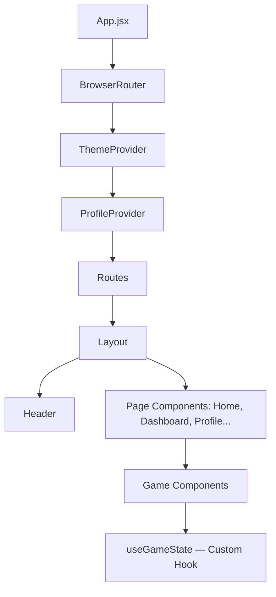
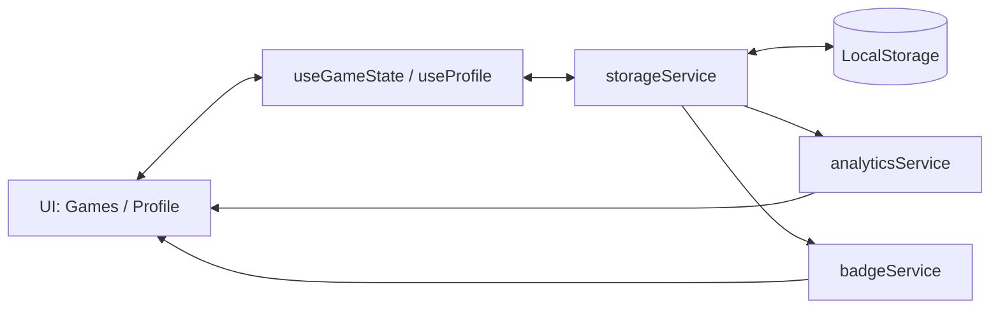

# ✅ Memory Trainer: React Architecture & Game

Сучасний веб-додаток для тренування когнітивних навичок, створений на Vite + React 19. Проєкт включає 8 різноманітних ігор (пам'ять, увага, швидкість), систему профілів, досягнень (бейджів) та аналітику прогресу.
Додаток використовує Context API для глобального управління станом (теми, профілі), Custom Hooks для ігрової логіки та Local Storage для збереження результатів користувача.

---
🚀 Стек технологій

⚡ Vite — надшвидкий інструмент збірки.

⚛️ React 19 — остання версія бібліотеки з покращеною продуктивністю.

🎨 Tailwind CSS 4 — сучасна стилізація через utility-first класи.

🛣️ React Router 7 — декларативна маршрутизація (SPA).

💾 LocalStorage API — збереження профілю, статистики та ігрових сесій без зовнішнього бекенду.

📊 Analytics & Badge Services — власна логіка розрахунку рівня пам'яті та автоматичного нарахування нагород.

---

## 🚀 Запуск проєкту

```
# встановлення залежностей
npm install

# запуск у dev режимі
npm run dev

# білд у продакшн
npm run build

# попередній перегляд білда
npm run preview
```
---
---

## 📂 Структура проєкту

```  text
memory-trainer/
├── src/
│   ├── components/
│   │   ├── layout/        # Layout, Header (структура сторінок)
│   │   └── ui/            # Базові UI-компоненти (Button, Card, Modal, Badge)
│   ├── contexts/          # Глобальний стан (Profile, Theme)
│   ├── games/             # Логіка та UI 8 ігор (MemoryCards, SimonSays тощо)
│   ├── hooks/             # Custom Hooks (useGameState, useTimer, useLocalStorage)
│   ├── pages/             # Сторінки (Dashboard, Leaderboard, Profile, Settings)
│   ├── services/          # Бізнес-логіка (analytics, storage, badge services)
│   ├── App.jsx            # Конфігурація маршрутів (React Router)
│   └── main.jsx           # Точка входу
├── package.json           # Залежності та скрипти
└── vite.config.js         # Конфігурація Vite
```

---
## 🌳 Component Tree


---


## 🔄 Data Flow Diagram



---

## 📋 Опис архітектури даних

### 1️⃣ Сервісний шар (services/)
storageService: централізований інтерфейс для роботи з localStorage. Зберігає сесії, профілі та нагороди.

analyticsService: розраховує "Рівень пам'яті" на основі найкращих результатів, відстежує серії тренувань (streaks) та динаміку прогресу.

badgeService: автоматично перевіряє умови виконання завдань після кожної гри та видає досягнення.

---

### 2️⃣ Custom Hook: useGameState
Керує життєвим циклом будь-якої гри:

Стани: IDLE, PLAYING, PAUSED, FINISHED.

Функції: запуск, пауза, завершення з автоматичним збереженням результатів у storageService.

Гарячі клавіші: реалізована підтримка Escape та P для паузи.

---

### 3️⃣ Context API
ProfileContext: надає доступ до даних користувача, статистики та списку бейджів у будь-якій частині додатку.

ThemeContext: керує колірною схемою та налаштуваннями доступності (наприклад, вимкнення анімацій).

---

## ✨ Особливості

🎮 8 когнітивних ігор: від класичних карт пам'яті до завдань на подвійну концентрацію (Dual Task).

📊 Глибока аналітика: розрахунок індивідуального рівня пам'яті (0-100) та відстеження щоденної активності.

🏆 Система досягнень: отримання візуальних бейджів за ігрові успіхи.

⌨️ Accessibility & Hotkeys: підтримка керування з клавіатури ('M' — звук, 'P' — пауза) та налаштування інтерфейсу.

📱 Responsive Design: повна адаптація під мобільні пристрої завдяки Tailwind CSS 4.


---


